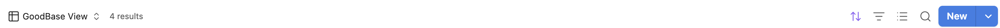

# GoodBases

A custom [Bases](https://help.obsidian.md/bases) view for
[Obsidian](https://obsidian.md) that renders your databases as a
Notion-style table: clean chrome, hover-reveal OPEN buttons, colored
value pills, and inline cell editing.


> Requires Obsidian **1.10.2+** with the **Bases** core plugin enabled.

## Demo


## Features

- **Notion-style table** — system font stack, hairline borders, hover
  wash, and a horizontal scroll container so columns never crush, even
  in embeds and reading mode.
- **OPEN button** — hover a row to reveal a button that opens the note,
  just like Notion's database rows.
- **Colored pills** — list properties (tags, multitext) render as pills
  using Notion's 9-color palette (accurate light- and dark-mode values).
  Colors are assigned by a deterministic hash, so a value keeps its color
  forever — unless you choose your own.
- **Per-value color picker** — click the colored square next to any value
  in the pill select menu and pick a color from Notion's palette. Your
  choice is saved and applies everywhere that value appears. (You can also
  set colors in bulk with the *Pinned pill colors* view option —
  `value=color`, e.g. `Done=green`.)
- **Inline editing** — click a cell to edit text and numbers in a
  floating input; checkboxes toggle in place. Pill cells open a
  select-style menu listing every value already used for that property,
  with search and create-on-Enter.
- **Grouping support** — respects the Bases `group by` configuration.
- **View options** — wrap cell content (on by default), toggle vertical
  lines, force specific properties to render as pills, and pin pill
  colors.

## Usage

1. Enable the **Bases** core plugin and create a base.
2. In the base toolbar, open the view selector and choose
   **Notion-style table**.
3. Configure columns, filters, sorting, and grouping with the normal
   Bases controls; this view adds its own options (wrapping, vertical
   lines, pill properties, pinned colors) in the view settings.

Notes on editing:

- Only note frontmatter properties (`note.*`) are editable; `file.*`
  and `formula.*` columns are read-only by nature.
- `tags` pills are intentionally read-only for now — tags have special
  semantics and deserve a careful write path.

## Installation

### From the community plugin browser

Once accepted: **Settings → Community plugins → Browse**, search for
"GoodBases", install, and enable.

### Manual

1. Download `main.js`, `manifest.json`, and `styles.css` from the
   [latest release](https://github.com/FrancescoUmberto/GoodBases/releases).
2. Put them in `VaultRoot/.obsidian/plugins/good-bases/`.
3. Reload Obsidian and enable the plugin in **Settings → Community
   plugins**.

### Optional: Notion-style toolbar

The blue Notion-style **New** button and icon-only Sort / Filter /
Properties / Search are an **optional CSS snippet** (the toolbar is core
Obsidian UI, outside the plugin's view, so it isn't styled by the plugin
itself):

1. Copy
   [`snippets/goodbases-notion-toolbar.css`](snippets/goodbases-notion-toolbar.css)
   into `VaultRoot/.obsidian/snippets/`.
2. Enable it under **Settings → Appearance → CSS snippets**.

The snippet only affects a Base's toolbar while a GoodBases view is open;
every other base keeps its native toolbar.

<!-- ## Development

```bash
npm install
npm run dev    # esbuild watch mode with inline sourcemaps
npm run build  # type-check + production bundle → main.js
```

Point the repo (or a symlink) at
`VaultRoot/.obsidian/plugins/good-bases/` and reload the plugin in
Obsidian after each build. -->

## Support

GoodBases is free and open source, built and maintained in my spare
time. If it makes your vault a little nicer to work in, you can
[buy me a coffee](https://buymeacoffee.com/umbertofrancesco) ☕ — it
goes toward new features and keeping up with Obsidian's API changes.

## Changelog

The full history and downloadable builds are on the
[Releases page](https://github.com/FrancescoUmberto/GoodBases/releases).

### 0.4.0

**🎨 New — per-value color picker.** Click the colored square next to any
value in the pill select menu and pick a color from Notion's palette. Your
choice is saved (persisted to the *Pinned pill colors* option) and applies
everywhere that value appears.




Also in this release:

- **Changed:** cell content now wraps by default.
- **Changed:** colored pills use Notion's exact light- and dark-mode
  palette values.
- **Changed:** restyled the Bases toolbar for the Notion-style view — a
  Notion-like blue "New" button and icon-only Sort / Filter / Properties /
  Search, scoped so it only affects this plugin's views.
- **Fixed:** the inline edit box no longer lingers after you click away
  from a cell without changing it.


### 0.3.2

- **Added:** the project landing page, demo GIF, and a Buy Me a Coffee
  funding link.

### 0.3.1

- **Initial release:** Notion-style table view — colored pills, inline
  cell editing, the pill select editor, pinned pill colors, hover-reveal
  OPEN button, grouping support, and view options.

## Disclaimer

This plugin is not affiliated with, endorsed by, or sponsored by Notion
Labs, Inc. "Notion" is a trademark of Notion Labs, Inc.; it is used here
only to describe the visual style the view emulates.

## License

[MIT](LICENSE)
